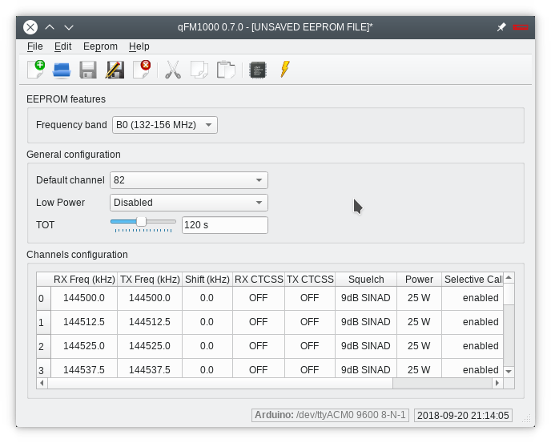

# qFm1000
> Simple tool for editing channels and configuration parameters of Philips FM1000 radio.

qFm1000 is a simple tool for editing channels and configuration parameters saved into the 24C16 EEPROM mounted inside any Philips FM1000 radio.

It's based on the Qt/C++ cross-platform framework and can be built using cmake in Linux, Mac and Windows with gcc, clang or Visual Studio.

## Releases

All releases are created using CPack extension of CMake builder.

### Linux

There are some deb packages preapred for different Debian-based Linux distribution. Just pick up the one for your OS and install it using `dpkg -i <file>.deb`. 

### MAC

There is no pre-compiled version for MAC. Still working to produce a official DMG release.

### Windows

Windows build are created using the official releases of Qt 5.9.2. Just download the MSI package and install it.

## Changelog

* 0.4.1
    * FIX: Fix build for old Qt version
    * FIX: Arduino serial port in Windows
* 0.4.0
    * ADD: Support for read/write EEPROM with Arduino
* 0.3.1
    * FIX: Power values and channel numbers
* 0.3.0
    * ADD: Support for squelch values
    * TOOL: Add Coverity Scan support
* 0.2.1
    * FIX: Bitwise error on eeprom flags
* 0.2.0
    * ADD: Simple error messages for invalid files
    * ADD: Tests for EEPROM methods
    * ADD: Travis builds
    * ADD: AppVeyor builds
    * FIX: EEPROM flags bitwise
* 0.1.3
    * ADD: "Save as" feature
* 0.1.0
    * CHANGE: New interface
    * ADD: TOT feature
* 0.0.0
    * Initial commit (import from qCw)

## Contributing

1. [Fork it](<https://github.com/sardylan/qfm1000/fork>).
2. Create your feature branch (`git checkout -b feature_foo`)
3. Commit your changes (`git commit -am "Add some foo"`)
4. Push to the branch in your repository (`git push origin feature_foo`)
5. Create a new Pull Request

## Development environment

The whole project is based on CMake and developed under GNU/Linux Ubuntu 17.04 using JetBrains CLion IDE, but can be
developed using any IDE, included [VIm](https://en.wikipedia.org/wiki/Vim_(text_editor)) or [Notepad](https://en.wikipedia.org/wiki/Microsoft_Notepad)

Please have a look to [BUILD.md](BUILD.md) for installing needed tools and libraries.

## Meta

Luca Cireddu - [@sardylan](https://twitter.com/sardylan) - sardylan@gmail.com

This program is free software: you can redistribute it and/or modify it under the terms of the GNU General Public
License as published by the Free Software Foundation, either version 3 of the License.

See [LICENSE.md](LICENSE.md) for more information.
